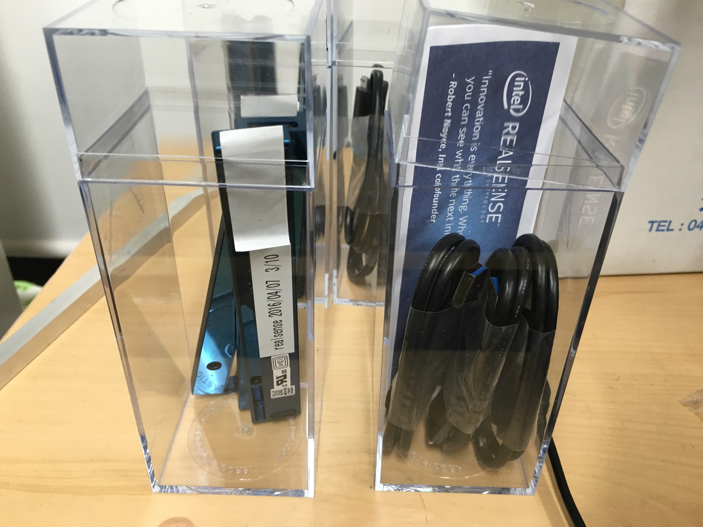
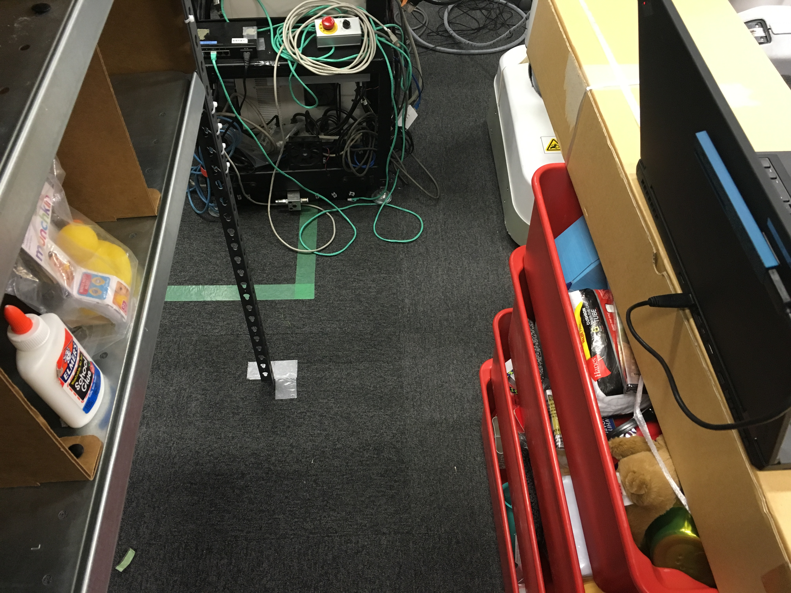
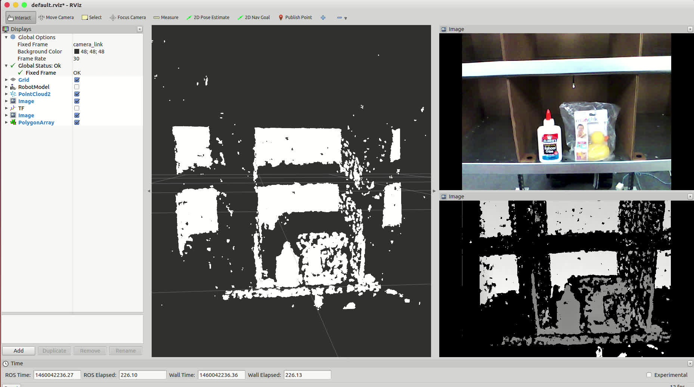
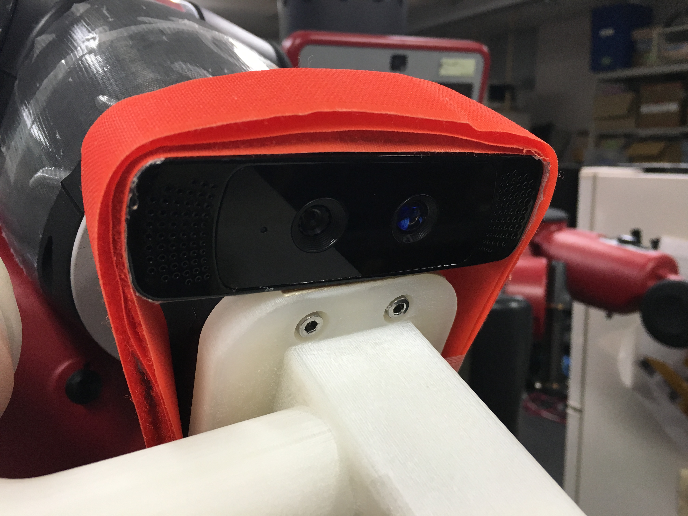
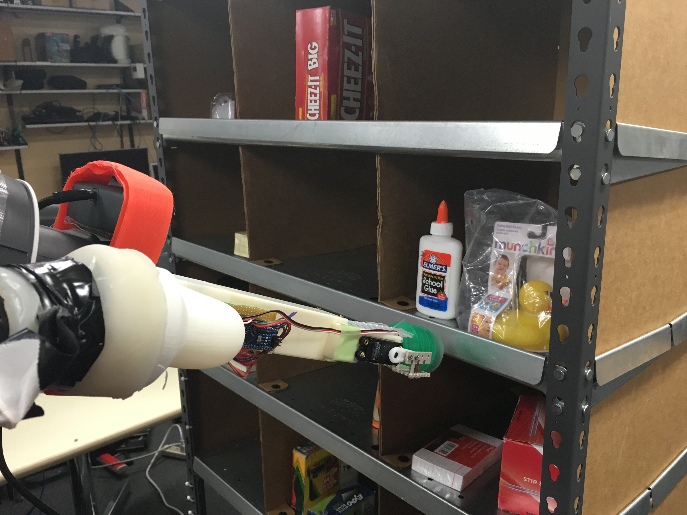
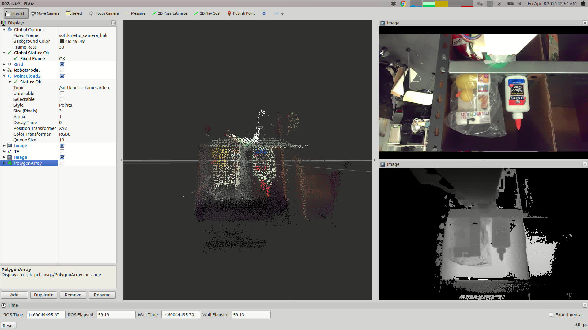

# jsk\_20160407\_evaluate\_realsense

## RealSense 001

### Specs

-   50cm以上離れている必要あり

-   depth image: `/camera/depth/image`:
    -   height: 360
    -   width: 480
    -   encoding: 32FC1
-   point xyz: `/camera/depth/points`:
    -   height: 360
    -   width: 480
-   point xyzrgb: `/camera/depth_registered/points`:
    -   出ない
-   color image `/camera/rgb/image_color`:
    -   height: 480
    -   width: 640
    -   encoding: rgb8

### Issues

-   depthとcolor画像の大きさが違う
-   depth\_registeredメッセージが出ない

### Experiment

*setup*

*Plane Estimation*

-   Movie: https://drive.google.com/open?id=0B9P1L--7Wd2veWxHZVB0dUF0UTg

## Real Sense 002

### Specs

- 15cm以上離れている必要あり

### Experiment

*setup*

*View*

- Movie: https://drive.google.com/open?id=0B9P1L--7Wd2vX0JIeHU5UFlwTWM

